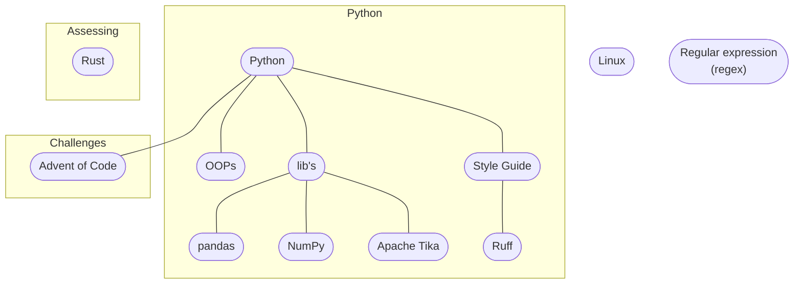

# sprout

```mermaid
graph TD

    subgraph Python
    p1([Python])

    p1.1([OOPs])
    p1.2([lib's])
    p1.3([Style Guide])
    p1 --- p1.1
    p1 --- p1.2
    p1 --- p1.3

    p1.2.1([pandas])
    p1.2.2([NumPy])
    p1.2.3([Apache Tika])
    p1.2 --- p1.2.1
    p1.2 --- p1.2.2
    p1.2 --- p1.2.3

    p1.3.1([Ruff])
    p1.3 --- p1.3.1
    end

    subgraph Assessing 
    r1([Rust])
    end

    subgraph Challenges
    aoc([Advent of Code])
    p1 --- aoc
    end

    l1([Linux])
    o1(["Regular expression
    (regex)"])
```
