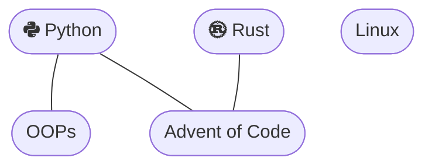

# sprout

```mermaid
graph TD
    p1([fab:fa-python Python])
    p1.1([OOPs])
    p1 --- p1.1

    r1([fab:fa-rust Rust])

    aoc([Advent of Code])
    p1 --- aoc
    r1 --- aoc

    l1([Linux])
```